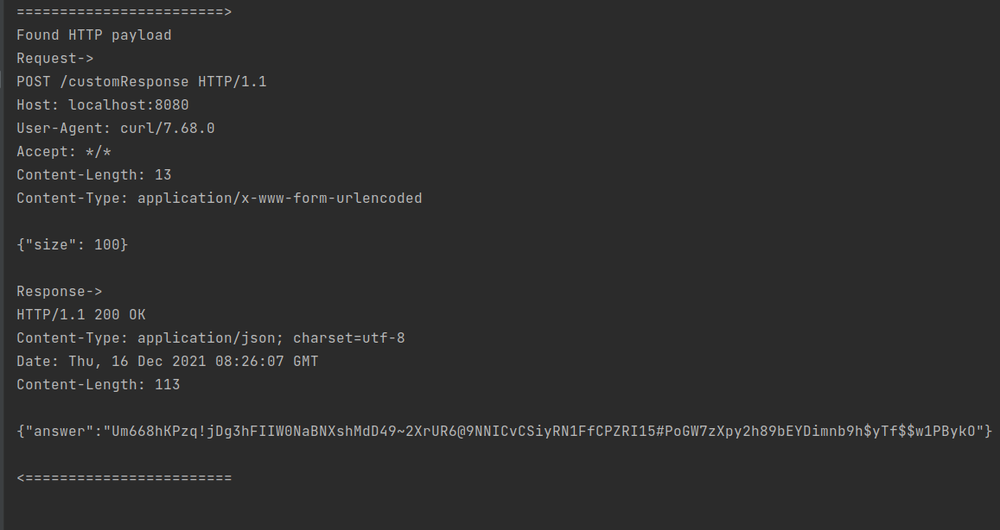

# Simple HTTP traffic captures using BCC
This branch contains our implementation for the code in our [article](https://seekret.io)

## Prerequisites
1. Any linux machine (ubuntu, debian, etc.)
2. BCC - (installation guide](https://github.com/iovisor/bcc/blob/master/INSTALL.md)
3. go version 1.16+ - [installation guide](https://go.dev/doc/install)

## Running the demo server
```bash
cd demo-server
go run main.go
```

## Running the sniffer
```bash
cd capture-traffic
sudo go run main.go
```

## Running test client
```bash
./client/run.sh
```

## Output
The entire HTTP payloads are written to the stdout of the sniffer every 10 seconds.

## Demo
Run the client


Output in the sniffer

