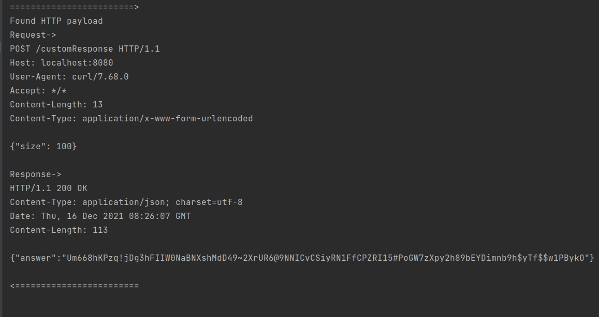

# Simple HTTP traffic captures using BCC
This branch contains our implementation for the code in our [article](https://seekret.io)

## Prerequisites
- Any linux machine (ubuntu, debian, etc.)
- BCC - [installation guide](https://github.com/iovisor/bcc/blob/master/INSTALL.md)
  - Installing BCC might not work as expected. So we are collecting good links for possible errors:
    - https://stackoverflow.com/questions/61978175/how-to-compile-bcc-on-ubuntu-20-04
    - https://github.com/iovisor/bcc/issues/3601
- go version 1.16+ - [installation guide](https://go.dev/doc/install)

You can install those requirements on your local machine, or you can use a predefined docker!
Note: The docker was tested on ubuntu 20.04 with kernel `5.11.0-43-generic`.
If you do have troubles with BCC from the docker, please install BCC and goland on your machine and don't use the docker.

```bash
docker pull gcr.io/seekret/ebpf-training-setup:latest
```
or
```bash
docker build -t gcr.io/seekret/ebpf-training-setup:latest .
```

### Setting up the docker environment
The command lines below are equivalent, and sets up the setup you need for the workshop.
In both cases we mount the local directory to the docker.

```bash
./setup_docker.sh
```

## Running the demo server
```bash
cd demo-server
go run main.go
```

## Running the sniffer
In the docker (`./setup_docker.sh`)
```bash
go run main.go ./sourcecode.c
```

On a local machine
```bash
cd capture-traffic
sudo go run main.go ./sourcecode.c
```

## Running test client
```bash
./client/run.sh
```

## Output
The entire HTTP payloads are written to the stdout of the sniffer every 10 seconds.

## Demo
Run the client


Output in the sniffer

