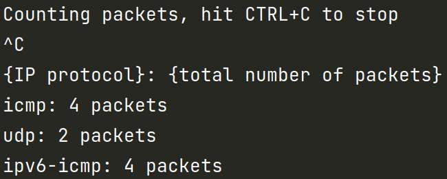

# Gentle introduction to XDP
This branch contains our implementation for the code in our [blog](https://seekret.io)

## Prerequisites
- Any linux machine (ubuntu, debian, etc.)
- BCC - [installation guide](https://github.com/iovisor/bcc/blob/master/INSTALL.md)
  - Installing BCC might not work as expected. So we are collecting good links for possible errors:
    - https://stackoverflow.com/questions/61978175/how-to-compile-bcc-on-ubuntu-20-04
    - https://github.com/iovisor/bcc/issues/3601
- go version 1.16+ - [installation guide](https://go.dev/doc/install)

You can install those requirements on your local machine, or you can use a predefined docker!
Note: The docker was tested on ubuntu 20.04 with kernel `5.11.0-43-generic`.
If you do have troubles with BCC from the docker, please install BCC on your machine and don't use the docker.

```bash
docker pull gcr.io/seekret/ebpf-training-setup:latest
```
or
```bash
docker build -t gcr.io/seekret/ebpf-training-setup:latest .
```

### Setting up the docker environment
The following command will open an interactive shell inside the docker, use it to run future commands.
```bash
./setup_docker.sh
``` 

## Running the XDP program

Open a second terminal and run the following:

In the docker (`./setup_docker.sh`)
```bash
go run xdp_runner.go xdp_prog.c lo
```

Or on your local machine
```bash
sudo go run xdp_runner.go xdp_prog.c lo
```
`lo` means loopback interface, use the `ip link` command to see all available interfaces.

## Running the test client
Run the following and wait for the script to finish. The script sends 2 ICMP requests and 2 ICMPv6 requests.
```bash
./client/run.sh
```

## Output
After running the client, unload the XDP program (ctrl + c) and check the stats to see the 8 ICMP packets that were captured - 4 ICMP requests and 4 ICMP responses (and maybe some other packets that were sent on your local interface).

## Demo
After stopping the XDP program, you should see something similar to the following:


