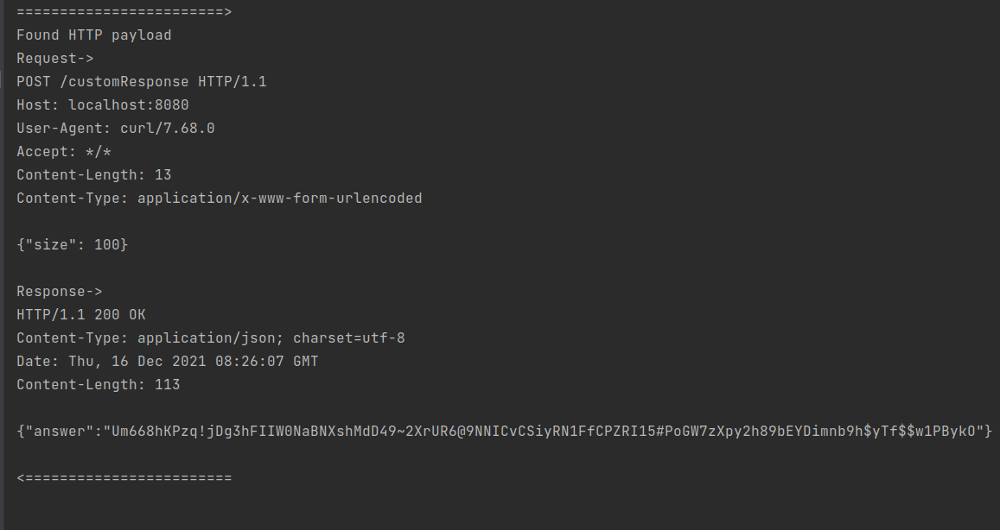

# Simple HTTP traffic captures using BCC
This branch contains our implementation for the code in our [article](https://seekret.io)

## Prerequisites
- Any linux machine (ubuntu, debian, etc.)
- BCC - [installation guide](https://github.com/iovisor/bcc/blob/master/INSTALL.md)
  - Installing BCC might not work as expected. So we are collecting good links for possible errors:
    - https://stackoverflow.com/questions/61978175/how-to-compile-bcc-on-ubuntu-20-04
    - https://github.com/iovisor/bcc/issues/3601
- go version 1.16+ - [installation guide](https://go.dev/doc/install)

You can install those requirements on your local machine, or you can use a predefined docker!
Note: The docker was tested on ubuntu 20.04 with kernel `5.11.0-43-generic`.
If you do have troubles with BCC from the docker, please install BCC and goland on your machine and don't use the docker.

## Running the demo server
```bash
cd demo-server
go run main.go
```

## Running test client
```bash
curl -X POST -v localhost:8080/customResponse -d '{"size": 50}'
```

## Running the final outcome sniffer
On a local machine
```bash
cd sniffer
sudo go run main.go ./solution.c
```

## Output
The entire HTTP payloads are written to the stdout of the sniffer every 1 second.

## Demo
Run the client


Output in the sniffer


## Step-By-Step tutorial

The following section is the transcript I extracted from a [webinar](add link) I've made.

I recommend you to use the transcript along with the video of the webinar.

The webinar covered the [blog](https://www.seekret.io/blog/a-practical-guide-to-capturing-production-traffic-with-ebpf/) of the same topic.

### Transcript:
The first thing to do is to implement the `accept4` hooks.
Let's start with an empty hooks

I've already created for you a file to work with [clean.c](./cmd/sniffer/clean.c). 

We start by copying the "hooks templates"
Copy:

```c
int syscall__probe_entry_<hook name>(struct pt_regs* ctx, <parameters....>) {
  return 0;
}

int syscall__probe_ret_<hook name>(struct pt_regs* ctx) {
  return 0;
}
```

In BCC the format of the naming is very important so pay attention to the name of the hook `syscall__probe_entry_<hook name>`.
you just need to replace `<hook name>` with the correct syscall name (`accept4`, `read`, `write`, or `close`).

The first parameter is called ctx, and it contains the input arguments in the entry hook and the return code in the exit hook

BCC has made our life easier, and instead of working hard to extract the input arguments
from the ctx, you can just add them to the signature of the hook!

So what is the signature of `accept4`? let's use man command.
Open bash and run:

```bash
man accept4
```

The output will be:

```bash
ACCEPT(2)                  Linux Programmer's Manual                 ACCEPT(2)

NAME
       accept, accept4 - accept a connection on a socket

SYNOPSIS
       #include <sys/types.h>          /* See NOTES */
       #include <sys/socket.h>

       int accept(int sockfd, struct sockaddr *addr, socklen_t *addrlen);

       #define _GNU_SOURCE             /* See feature_test_macros(7) */
       #include <sys/socket.h>

       int accept4(int sockfd, struct sockaddr *addr,
                   socklen_t *addrlen, int flags);
```

So we'll copy the input arguments `(int sockfd, struct sockaddr *addr, socklen_t *addrlen, int flags)`

A little twitch: socklen_t is defined in a header that is not accessible (`sys/socket.h`), so ill just use `size_t` instead.

So our signature of `accept4` entry hook should look like:

```c
int syscall__probe_entry_accept4(struct pt_regs* ctx, int sockfd, struct sockaddr *addr, size_t *addrlen, int flags)
```

Next we define a struct (`accept_args_t`) to hold the input arguments from the entry to the exit hooks.
The `address` parameter can be ipv4 or ipv6, so we create a union (`union sockaddr_t`) to make it a general struct.

Copy:

```c
union sockaddr_t {
  struct sockaddr sa;
  struct sockaddr_in in4;
  struct sockaddr_in6 in6;
};

struct accept_args_t {
  union sockaddr_t* addr;
};
```

Next we define the (eBPF) map (called `active_accept_args_map` its key is of `uint64_t` type and the values are `struct accept_args_t`) to hold the input arguments

Copy:

```c
BPF_HASH(active_accept_args_map, uint64_t, struct accept_args_t);
```

Now we will dive into the hook themselves. We start with the entry hook.
The first task to do is to get a key for the mapping, we will use a key composed out of the pid and the thread global id

Add the following as the first line of the `accept4` entry hook:
```c
  uint64_t id = bpf_get_current_pid_tgid();
```

Now we create the `struct accept_args` instance to hold the input arguments

```c
    struct accept_args_t accept_args = {};
    accept_args.addr = (union sockaddr_t*)addr;
```

The last step here is to save the struct to the map, we do so by:
```C
    active_accept_args_map.update(&id, &accept_args);
```

We finished with the entry of accept hook!

Going to the exit hook

So we want to pull the input arguments, for that we need to grab them from the map, 
but first we need to know the key, so we once again generate the ID

```C
	uint64_t id = bpf_get_current_pid_tgid();
```

Now looking up the key in the map
```C 
	struct accept_args_t* accept_args = active_accept_args_map.lookup(&id);
```

We must check the pointer is not null before accessing it, otherwise the verifier will reject us

```C
	if (accept_args != NULL) {
	    // process
	}
```

Now that we know the arguments are not null, we can process them and delete them from the map, as they are no longer needed.

We add the following line inside the `if` clause!

```C
    active_accept_args_map.delete(&id);
```

Let's check the outline is ready, and we didn't miss anything

```bash
cd workshop3/cmd/sniffer
sudo go run main.go clean.c --verbose --level 0
```

So the general outline is ready
Now we can process the input arguments.

So let's create a helper function to process it

```C
static __inline void process_syscall_accept(struct pt_regs* ctx, uint64_t id, const struct accept_args_t* args) {

}
```

We get the context, the id and the input arguments as parameters to the helper function.

Let's just add the call to the function inside the `if` clause

```C
    process_syscall_accept(ctx, id, accept_args);
```

The final outcome of the exit hook should look like:

```C
int syscall__probe_ret_accept4(struct pt_regs* ctx) {
    int64_t id = bpf_get_current_pid_tgid();

    struct accept_args_t* accept_args = active_accept_args_map.lookup(&id);
    if (accept_args != NULL) {
        process_syscall_accept(ctx, id, accept_args);
        active_accept_args_map.delete(&id);
    }

    return 0;
}
```

Now let's implement the helper function.

First we need to check if the syscall resulted in success
we check the return code, and if it is positive, we know that accept4 syscall ended successfully

```C
    int ret_fd = PT_REGS_RC(ctx);
    if (ret_fd <= 0) {
        return;
    }
```

The purpose of the macro `PT_REGS_RC` is to extract the return code from the context.

Next need a way to identify a single connection among all connections
it will help us match different events of the same connection in the user mode.

We use the pid and the fd (file descriptor) as ID of the connection.

```C
struct conn_id_t {
  uint32_t pid;
  int32_t fd;
};
```

Since we will have the same ID among all hooks, we'll just create a method for that
```C
static __inline struct conn_id_t create_conn_id(uint64_t id, int fd) {
  struct conn_id_t conn_id = {};
  uint32_t pid = id >> 32;
  conn_id.pid = pid;
  conn_id.fd = fd;
  return conn_id;
}
```

Now we are almost ready to send the event to the user mode.

For that, we need to define a struct to send to the user mode.

We will send the event time, the connection id, and the address.

```C
struct socket_open_event_t {
  uint64_t timestamp_ns;
  struct conn_id_t conn_id;
  union sockaddr_t addr;
};
```

Now we need to declare on the perf event that will transmit the event from the kernel to the user mode

```C
BPF_PERF_OUTPUT(socket_open_events);
```

Now we build the `socket_open_event_t` instance

```C
	struct socket_open_event_t open_event = {};
	open_event.timestamp_ns = bpf_ktime_get_ns();
	open_event.conn_id = create_conn_id(id, ret_fd);
	bpf_probe_read(&open_event.addr, sizeof(open_event.addr), args->addr);
```

And we send it to the user mode

```C
    socket_open_events.perf_submit(ctx, &open_event, sizeof(struct socket_open_event_t));
```

The perf event has a method called `perf_submit` to send the event. 
We provide the event and the size of the event, the event can arrive to the user mode.

So we are ready to launch the first level!

Run:
```bash
sudo go run main.go clean.c --verbose --level 1
```

Run a request to the server:
```bash
curl -4 -X POST localhost:8080/customResponse -d '{"size": 20}'
```

So we saw in detail how to implement the first hook.

Let's start with creating the struct (`struct data_args_t`) and the map (`active_read_args_map`) that will hold the input arguments

```C
struct data_args_t {
  int32_t fd;
  const char* buf;
};
```

We simply save the fd and the pointer to the buffer.

```C
BPF_HASH(active_read_args_map, uint64_t, struct data_args_t);
```

Now let's go to the hooks
```C
int syscall__probe_entry_read(struct pt_regs* ctx, int fd, char* buf, size_t count) {
  uint64_t id = bpf_get_current_pid_tgid();

  struct data_args_t read_args = {};
  read_args.fd = fd;
  read_args.buf = buf;
  active_read_args_map.update(&id, &read_args);

  return 0;
}

int syscall__probe_ret_read(struct pt_regs* ctx) {
  uint64_t id = bpf_get_current_pid_tgid();

  struct data_args_t* read_args = active_read_args_map.lookup(&id);
  if (read_args != NULL) {
      // process
      active_read_args_map.delete(&id);
  }

  return 0;
}
```

You can verify the signature by using `man read` like we did in the `accept4` hooks.

You can see how similar it is to the original accept hook the difference is in the name, and of course the input arguments.

Before diving to the main process logic, let's define the event (`struct socket_data_event_t`) we send

The `enum traffic_direction_t` will help the user mode to distinguish between incoming (ingress) traffic (captured by the `read` hooks), and 
outgoing (egress) traffic (captured by the `write` hooks).
```C
enum traffic_direction_t {
  kEgress,
  kIngress,
};

#define DATA_LEN 400

struct socket_data_event_t {
  uint64_t timestamp_ns;
  struct conn_id_t conn_id;
  enum traffic_direction_t direction;
  uint32_t msg_size;
  char msg[DATA_LEN];
};
```

Now let's add the perf event called `socket_data_events`.

```C
BPF_PERF_OUTPUT(socket_data_events);
```


We start with implementing a method to check if the buffer represent HTTP data.

```C
static inline bool is_http_connection(const char* buf, size_t count) {
  if (count < 16) {
    return false;
  }

  if (buf[0] == 'H' && buf[1] == 'T' && buf[2] == 'T' && buf[3] == 'P') {
    return true;
  }

  if (buf[0] == 'P' && buf[1] == 'O' && buf[2] == 'S' && buf[3] == 'T') {
    return true;
  }

  return false;
}
```

So my simple function just check if the buffer is at least of 16 bytes (that's the minimum for http),
and I check if it starts with HTTP or POST, if so, we consider it as http data.

Now let's dive into the process function

```C
static inline void process_data(struct pt_regs* ctx, uint64_t id, enum traffic_direction_t direction, const struct data_args_t* args) {
  // Always check access to pointer before accessing them.
  if (args->buf == NULL) {
    return;
  }

  int return_code = PT_REGS_RC(ctx);
  if (return_code <= 0) {
    return;
  }

  size_t bytes_count = return_code;

  // Check if the connection is already HTTP, or check if that's a new connection, check protocol and return true if that's HTTP.
  if (is_http_connection(args->buf, bytes_count)) {
    struct socket_data_event_t event = {};
    // Fill the metadata of the data event.
    event.timestamp_ns = bpf_ktime_get_ns();
    event.direction = direction;
    event.conn_id = create_conn_id(id, args->fd);
    event.msg_size = bytes_count < DATA_LEN ? bytes_count : DATA_LEN;
    bpf_probe_read(&event.msg, event.msg_size, args->buf);
    socket_data_events.perf_submit(ctx, &event, sizeof(struct socket_data_event_t));
  }
}
```

We check the buffer is not null, we check the return code is not negative or zero (meaning, it is not an error).

If the data is http, then we build the event and send it to the user mode.

Now we add it to the exit-hook inside the `if` clause.

```C
	process_data(ctx, id, kIngress, read_args);
```

Finished with level2, so let's check it out.

Run:
```bash
sudo go run main.go clean.c --verbose --level 2
```

Now heading to the `write` hook. 

Let's define a dedicated map (`active_write_args_map`) for the `write` hook input arguments

```c
BPF_HASH(active_write_args_map, uint64_t, struct data_args_t);
```

We'll just copy the read hooks, change everywhere from `read` to `write`
don't forget to change the ingress to egress

And that's it, we are finished with level3.

```bash
sudo go run main.go clean.c --verbose --level 3
```

Finishing with the `close` hooks.

Same drill, create the map and the perf event

```C
struct close_args_t {
  int32_t fd;
};

struct socket_close_event_t {
  uint64_t timestamp_ns;
  struct conn_id_t conn_id;
};

BPF_HASH(active_close_args_map, uint64_t, struct close_args_t);
BPF_PERF_OUTPUT(socket_close_events);
```

We add the hooks

```C
int syscall__probe_entry_close(struct pt_regs* ctx, int fd) {
  uint64_t id = bpf_get_current_pid_tgid();
  struct close_args_t close_args;
  close_args.fd = fd;
  active_close_args_map.update(&id, &close_args);

  return 0;
}

int syscall__probe_ret_close(struct pt_regs* ctx) {
  uint64_t id = bpf_get_current_pid_tgid();
  const struct close_args_t* close_args = active_close_args_map.lookup(&id);
  if (close_args != NULL) {
    process_syscall_close(ctx, id, close_args->fd);
    active_close_args_map.delete(&id);
  }
  return 0;
}
```

Adding the processing function

```C
static inline void process_syscall_close(struct pt_regs* ctx, uint64_t id, int fd) {
  int ret_val = PT_REGS_RC(ctx);
  if (ret_val < 0) {
    return;
  }

  // Send to the user mode an event indicating the connection was closed.
  struct socket_close_event_t close_event = {};
  close_event.timestamp_ns = bpf_ktime_get_ns();
  close_event.conn_id = create_conn_id(id, fd);

  socket_close_events.perf_submit(ctx, &close_event, sizeof(struct socket_close_event_t));
}
```

Finished.

Run:
```bash
sudo go run main.go clean.c --verbose --level 4
```

And now without verbose logs

```bash
sudo go run main.go clean.c --level 4
```

That's it!
